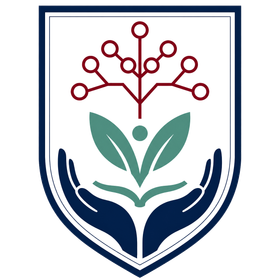

<p align="center">
  
</p>

<h1 align="center">Cambridge AI for Wellbeing Society</h1>

<p align="center">
  <em>Responsible AI research, education, and community for human wellbeing.</em>
</p>

<p align="center">
  <a href="https://ai4wellbeing.github.io"><strong>ai4wellbeing.github.io</strong></a>
</p>

## About

The Cambridge AI for Wellbeing Society (AI4W) is an interdisciplinary, Cambridge-based
community exploring how AI systems can be designed, evaluated, and governed to support
human flourishing. We connect AI research with practical questions in health, education,
and resilience, and we foreground safety, governance, privacy, and social impact in the
design of intelligent systems.

This repository is the society's home on the web — a single, quiet page introducing our
mission, focus areas, events, and people, and inviting students, researchers,
practitioners, and partners to build the society with us.

Our research themes:

- **Edge LLMs for Wellbeing** — efficient, private, and context-aware language models
  for personal, clinical, and community wellbeing applications.
- **AI Safety and Resilience** — attack, defense, robustness, and evaluation methods
  for AI systems deployed in sensitive human environments.
- **Digital Mental Health** — human-centered AI tools that support reflection, early
  intervention, access, and continuity of care.
- **AI Governance and Society** — policy, ethics, and participatory design for
  responsible AI adoption in institutions and public life.

## Founder

**[Hanlin Cai](https://caihanlin.com)** — PhD student in the Internet of Everything
Group at the University of Cambridge and Cambridge Trust Scholar. His research spans
edge LLMs, LLM networking, and attack-defense-resilience for intelligent systems.

<p>
  <a href="https://caihanlin.com">Website</a> ·
  <a href="https://scholar.google.com/citations?user=8igSoWgAAAAJ">Google Scholar</a> ·
  <a href="https://linkedin.com/in/hanlincai">LinkedIn</a> ·
  <a href="https://github.com/GuangLun2000">GitHub</a>
</p>

## Built with

A deliberately small stack, tuned for speed and longevity:

- [Astro](https://astro.build) — fully static output; the only client-side JavaScript
  is the contact form's enhancement script
- Build-time image optimization (AVIF / WebP) via `astro:assets`
- Self-hosted typefaces: Cormorant Garamond, Source Serif 4, and Source Sans 3
- Contact form delivered by [Formspree](https://formspree.io) — the endpoint lives in
  `src/data/site.ts`, while the recipient address stays private in the Formspree
  dashboard
- Published with GitHub Pages on every push to `main`

## Development

Requires Node.js ≥ 22.12.

```bash
npm install
npm run dev
```

---

<p align="center">
  <sub>
    An independent community initiative. Not an official website of the University of
    Cambridge — the site uses a Cambridge-inspired visual language but no official
    University brand assets.
  </sub>
</p>
